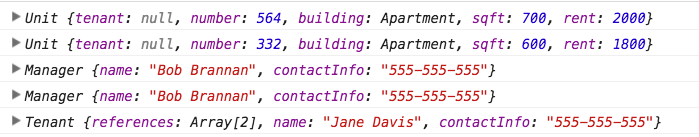
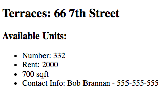

#  OOP Apartments

## Learning Objectives

- Demonstrate a working knowledge of object properties and methods.
- Create objects using constructor notation, as well as instances of those objects using the new keyword.
- Compare and contrast creating objects using literal notation vs. constructor notation.
- Define methods on your classes.
- Understand object inheritance.

> ***Note:*** _This can be a pair programming activity or done independently._

## Exercise

#### Requirements

* Implement constructors and prototype methods for `Person`, `Manager`, `Tenant`, `Apartment`, and `Unit` (see starter code in `main.js`).
* Implement inheritance for the following:
  * `Manager` inherits from `Person`.
  * `Tenant` inherits from `Person`.

How do I know if an object is of a particular class type? Use this conditional:

`myObject instanceof MyClass` evaluates to either true or false

#### Starter code

Instructions and starter code can be found in the `main.js` file in the `starter-code/apartment-app` folder.

#### Deliverable

Follow the instructions that are listed in the comments in `main.js`.

Be sure to use the console to check your work where instructed.

## Hungry for More?
- Display each available apartment on the page like so:

- Implement templating when displaying data on the page using [handlebarsjs](http://handlebarsjs.com/).

## Need More Review?
- Videos
	- JS Circuits - Constructor Notation - [Student Directory](https://generalassembly.wistia.com/medias/cjdt6hhkfz)
	- JS Circuits - Objects Past, Present & Future - [Date Object](https://generalassembly.wistia.com/medias/ga9vu35oz6)
	- JS Circuits - [Constructor vs. Literal Notation](https://generalassembly.wistia.com/medias/86ik38eakk)
	- [OOP Intro](https://generalassembly.wistia.com/medias/lahxav6p4z)
	- [OOP Case Study](https://generalassembly.wistia.com/medias/0bgiqqwd68)
	- [OOP Case Study #2](https://generalassembly.wistia.com/medias/lwjshtw79q)
- Readings
	- MDN - [Intro to OOP](https://developer.mozilla.org/en-US/docs/Web/JavaScript/Introduction_to_Object-Oriented_JavaScript)
	- [JS ES6 Classes](http://2ality.com/2015/02/es6-classes-final.html#referring_to_super-properties_in_methods)
	- [Object Oriented Analysis and Design with Applications, by Grady Booch and Others](http://www.goodreads.com/book/show/424923.Object_Oriented_Analysis_and_Design_with_Applications)
	- [Great Lecture Notes](https://atomicobject.com/resources/oo-programming/introduction-motivation-for-oo)
	- [OOP in JS from JavascriptIsSexy](http://javascriptissexy.com/oop-in-javascript-what-you-need-to-know/)
	- [Javascript, The Good Parts](http://www.goodreads.com/book/show/2998152-javascript)
	- [Practical Object Oriented Design in Ruby, by Sandi Metz](http://www.poodr.com/)

